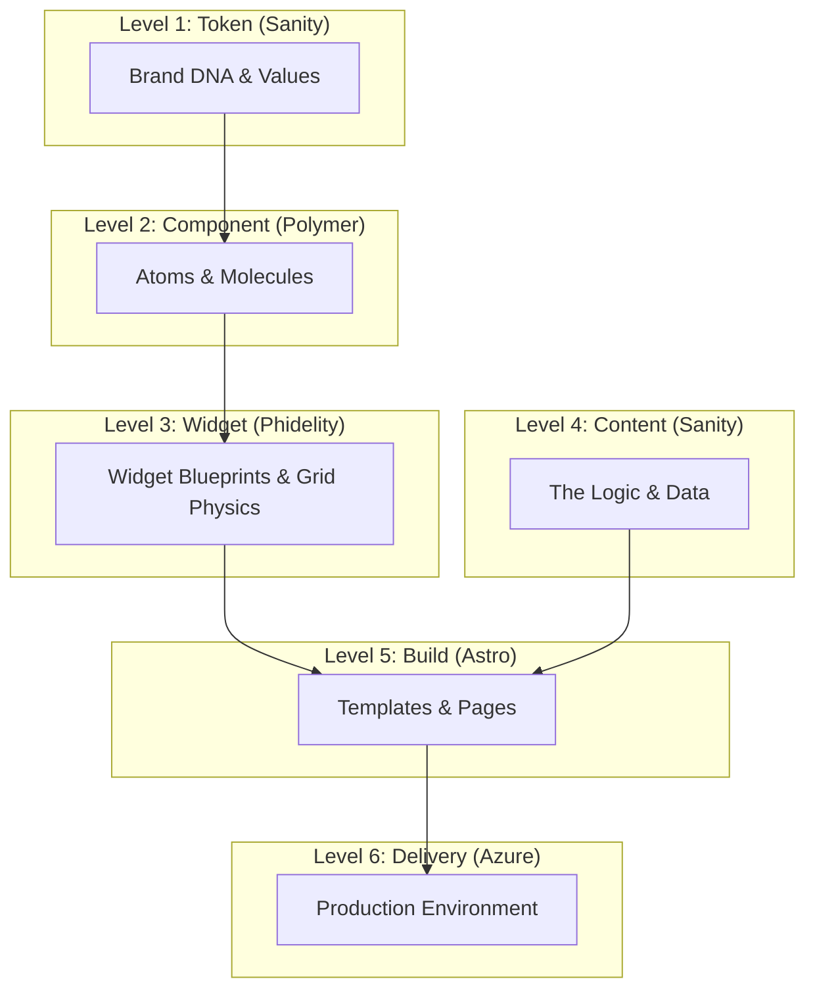

# The Composable Architecture: The 6-Layer Stack

This document defines the definitive technical architecture, mapping Brad Frost's Atomic Design principles to specific technology providers.

## 1. Token Layer (The DNA)
*   **Definition:** The atomic values used to build the system.
*   **Focus:** **Identity (The Skin)**.
*   **Content:** Colors, Font Families, Border Radius, Shadows.
*   **Provider Options:**
    *   **CMS:** **Sanity** / **Contentful**.
    *   **Design Tool:** **Figma Variables**.
    *   **Git-Based:** **Style Dictionary** / **JSON**.
*   **Role:** Stores "Brand Variables" (e.g., Red vs Blue).

## 2. Component Layer (The Matter)
*   **Definition:** Atomic Primitives and Molecular combos. Markup, Javascript logic, and generic styling.
*   **Sub-Layers & Provider Options:**
    *   **2a. Basic Atoms & Styling:**
        *   **Enterprise:** **Designsystemet**.
        *   **Headless:** **Radix UI** / **Headless UI**.
        *   **Monolithic:** **Material UI** / **Ant Design**.
    *   **2b. The Logic Engine (Snippets):**
        *   **Modern:** **Vanilla JS (ES6+)** / **Alpine.js**.
        *   **Legacy:** **jQuery** (if required).
    *   **2c. Molecular Specialists (Advanced):**
        *   **Charts:** **eCharts** / **Highcharts** / **Recharts**.
        *   **Time & Date:** **Day.js** / **date-fns**.
        *   **Tables:** **TanStack Table** / **AG Grid**.
        *   **Maps:** **Leaflet** / **Google Maps**.
*   **Role:** Provides the detailed "Lego Bricks".

## 3. Widget Layer (The Factory)
*   **Definition:** Blueprints. The physical construction of reusable product modules.
*   **Focus:** **Physics (The Skeleton)**.
*   **Content:** Layout Grid, Spacing Logic, Typographic Scale, Breakpoints.
*   **Provider Options:**
    *   **Sovereign:** **Phidelity** (Container Queries, Golden Ratio).
    *   **Utility:** **Tailwind CSS** (Standard Grid, Fixed Scale).
    *   **Typed:** **Panda CSS** / **Vanilla Extract**.
*   **Role:** Connects "Matter" (Foundation) using "Physics" (Layout).
    *   *Note:* If using **Phidelity**, the **Spacing & Type Scale** are algorithmic (Golden Ratio) and live here, NOT in the Token Layer.

## 4. Content Layer (The real data)
*   **Definition:** The energy breathing live data into the widgets
*   **Provider Options:**
    *   **Structured Content:** **Sanity** / **Contentful** / **Strapi**.
    *   **Visual Editor:** **Storyblok** / **Builder.io**.
    *   **Files:** **MDX** / **Git-based Markdown**.
*   **Role:** The Animator. Separates "Editorial Velocity" from "Code Velocity".

## 5. Build Layer (The Assembly)
*   **Definition:** Assembling Widgets/Organisms into larger reusable templates and pages.
*   **Provider Options:**
    *   **Islands Arch:** **Astro**.
    *   **React SPA/SSR:** **Next.js** / **Remix**.
    *   **Vue/Svelte:** **Nuxt** / **SvelteKit**.
*   **Role:** The Renderer. Handles Routing and State hydration.

## 6. Delivery Layer (The Stage)
*   **Definition:** The infrastructure where the experience occurs.
*   **Provider Options:**
    *   **Cloud:** **Microsoft Azure** / **AWS** / **GCP**.
    *   **CDN/Edge:** **Vercel** / **Netlify**.
    *   **Container:** **Docker** / **Kubernetes**.
*   **Role:** The Host. Infrastructure, Security, Scaling.

---

## Visual Summary

